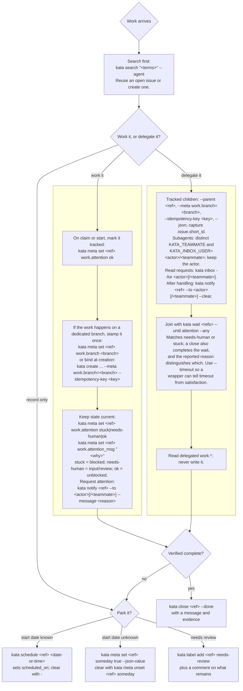

# kata カタ

The issue tracker built for coding agents and the humans steering them.

Coding agents need somewhere durable to track work: not a chat thread, not a
markdown to-do list. kata gives them a local task ledger they can drive from the
CLI: create, claim, relate, and close issues with evidence. Humans supervise the
same work in a terminal UI. By default, issue state lives in a local SQLite
database, so your repo stays clean and no hosted tracker is required. When a team
of humans and agents needs to share, you can opt into a remote daemon or
federation; a shared daemon can use Postgres by setting `KATA_DSN`.
Production Postgres deployments can use separate schema-owner and runtime roles;
see the [operator ceremony](docs/operations/postgres.md).
Go applications can instead mount kata's listener-free HTTP service in-process;
see [Embedding kata in Go](docs/development/embedding.md).
MCP clients can start Kata's native server over stdio or Streamable HTTP with
`kata mcp serve`. It binds the current workspace's project by default, and can
serve a fixed allowlist or the complete daemon catalog on request. Sixteen
section loaders progressively expose Kata's typed issue, administration,
cron, and event workflows. See the [MCP reference](docs/reference/mcp.md).

The documentation in [`docs/`](docs/) is the definitive guide, published with
Zensical at <https://katatracker.com/>.

> **Stable:** Since v0.14.0, kata releases preserve backward compatibility
> across upgrades.

The latest release is [0.18.0](docs/changelog.md#0180). It adds teammate
attention requests, issue-scoped worker credentials, and more ways to find
work. See the [upgrade guidance](docs/get-started/install.md#upgrading-to-0180)
when updating remote or federated daemons.

## Install

macOS:

```sh
brew install kata
```

Linux, or macOS without Homebrew:

```sh
curl -fsSL https://katatracker.com/install.sh | bash
```

Linux and WSL 2 users who already use
[Homebrew](https://docs.brew.sh/Homebrew-on-Linux) can also run
`brew install kata`.

Windows PowerShell:

```powershell
powershell -ExecutionPolicy ByPass -c "irm https://katatracker.com/install.ps1 | iex"
```

The installer detects your OS and CPU architecture, downloads the latest GitHub
release archive, and verifies it against `SHA256SUMS` before installing. Confirm
the install with:

```sh
kata version
```

Release-archive builds update themselves with `kata update`. Homebrew installs
use `brew upgrade kata`; Linux `.deb` and `.rpm` packages are published for
`amd64` and `arm64` and remain owned by the system package manager. Prefer to
build from source? kata needs **Go 1.27 or later**:

```sh
go install go.kenn.io/kata/cmd/kata@latest
```

Module-source installs include the CLI, daemon, and TUI but not the compiled
browser bundle. Install a release binary, or build from a clone with
`make install`, to use `kata ui`.

Go installs to `$(go env GOBIN)`, falling back to `$(go env GOPATH)/bin` (often
`~/go/bin`); put that directory on your `PATH`. See
[Install](docs/get-started/install.md) for package downloads, manual release
downloads, and build-from-source steps.



## Quickstart

```sh
cd your-repo
kata init                              # bind this workspace to a kata project
kata create "fix login race"           # prints a short id, e.g. abc4
kata list                              # see open work
kata show abc4                         # inspect by short id
kata tui                               # browse and triage interactively
kata tui abc4                          # open an issue directly in the TUI
kata ui                                # open the same ledger in a browser
```

`kata create` prints each issue's short id; use it in later commands. Close only
when the work is complete and verified:

```sh
kata close abc4 --done \
  --message "Fixed the login race and verified the relevant tests pass." \
  --commit <sha>
```

For agent-heavy workspaces, `kata init --with-agents` also writes a managed kata
briefing into agent guidance files. It refreshes existing real `AGENTS.md` and
`CLAUDE.md` files, or creates `AGENTS.md` when neither exists, without
overwriting the rest of either file. Codex-only workspaces can instead use
`kata init --with-codex-hooks` to install dynamic contract context and the
`work.attention` SessionStart lifecycle into `.codex/hooks.json`.

## Why kata

- **Built for agents.** Stable short refs, `--json` and `--agent` output,
  idempotent creates, semantic-aware search, a claim flow, and predictable
  failure modes agents can script against.
- **Made for humans too.** `kata tui` and `kata ui` browse, triage, and
  supervise agent-written work over the same data. The browser app is served
  by the daemon and needs no separate backend.
- **Local-first, repo-clean.** One Go binary, no runtime dependencies. Issue
  state lives in SQLite under `KATA_HOME`; your repo commits only a small,
  secret-free `.kata.toml`.
- **Auditable by design.** Closing an issue is an explicit completion claim with
  a reason, message, evidence, and actor attribution, on top of editable
  comments and durable events.

## How kata compares

kata is intentionally small. It is not a project-management suite, a git
workflow engine, or an agent worker pool. It is a durable task ledger that
humans and agents can both operate.

It is also not a SaaS issue tracker. Linear, Jira, GitHub Issues, ClickUp, and
similar tools are shared online systems for planning, dashboards, assignment,
and cross-team reporting. kata is local-first, instant from the CLI/TUI, and
designed around agent-first ergonomics: stable refs, predictable output,
idempotent creates, claim flows, and evidence-based closes. See
[Comparisons with SaaS issue trackers](docs/guide/comparisons.md) for the
matrix.

[Beads](https://github.com/gastownhall/beads) keeps issue state in a
project-local `.beads/` Dolt database with native history, branching, and
push/pull. [git-bug](https://github.com/git-bug/git-bug) stores issues as git
objects under custom refs and syncs them over `git push` and `git pull`. kata
makes a different bet: the ledger is a local service next to your workspaces,
not data carried in the repository. That keeps the workspace clean, works the
same in non-git directories, and keeps issue history out of code history. The
trade-off is that kata does not ride git remotes for sharing; the remote daemon
and federation cover that instead.

Moving from Beads? See
[Migrating from Beads](docs/guide/migrating-from-beads.md).
`kata import --source-format beads` drives the `bd` CLI and merges your issues
into a kata project.

## Documentation

The [docs site](docs/) is the definitive reference:

- Get started: [Quickstart](docs/get-started/quickstart.md) ·
  [Install](docs/get-started/install.md) ·
  [Changelog](docs/changelog.md)
- Guide: [Concepts](docs/guide/concepts.md) ·
  [Workspaces and projects](docs/guide/workspaces-projects.md) ·
  [Semantic search](docs/guide/semantic-search.md) ·
  [Migrating from Beads](docs/guide/migrating-from-beads.md)
- Reference: [CLI](docs/reference/cli.md) ·
  [Model Context Protocol](docs/reference/mcp.md) ·
  [Configuration](docs/reference/configuration.md)
- Workflows: [Agent workflows](docs/workflows/agents.md) ·
  [Sharing models](docs/workflows/sharing.md)
- Operations: [GitHub sync](docs/operations/github-sync.md) ·
  [Notion sync](docs/operations/notion-sync.md) ·
  [Plane sync](docs/operations/plane-sync.md) ·
  [Remote daemon](docs/operations/remote-daemon.md) ·
  [Federation](docs/operations/federation.md) ·
  [Hosted mode](docs/operations/hosted-mode.md) ·
  [Containers](docs/operations/containers.md) ·
  [PostgreSQL](docs/operations/postgres.md) ·
  [Backup and restore](docs/operations/backup-restore.md)
- Development: [Embedding kata in Go](docs/development/embedding.md) ·
  [Contributing](docs/development/contributing.md)

## For coding agents

Run `kata quickstart` (alias `kata agent-instructions`) for the operating
contract: search before creating, pass an idempotency key on create, prefer
`--agent` output, claim work with `kata claim`, and close only when the work is
verified. Close each verified issue promptly with valid evidence and a
substantive message. [Agent workflows](docs/workflows/agents.md) is the same
contract in long form.

On `main`, install the contract in every coding-agent session on this machine:

```sh
kata agent-hook install
```

For Codex, open Codex and run `/hooks` to trust the new hook. See
[Contract in every session](docs/workflows/agents.md#contract-in-every-session)
for all 18 targets, runtime requirements, attention capabilities and additional
Codex homes. Contract and available attention hooks are enabled by default;
use `--contract-only` to opt out of attention, or
`kata init --agent-hooks=codex,pi` for project setup. These commands are not included in 0.18.0.

Print the shorter managed briefing without changing the repository:

```sh
kata quickstart --format contract
# equivalent alias; selectors are accepted for user-local integrations
kata agent-instructions --format contract --workspace /path/to/workspace
kata quickstart --format contract --project spoke-project
```

Contract output is marker-free, has no terminal framing, works without an
initialized workspace, and performs no workspace mutation. It is rendered from
the same canonical body that `kata init --with-agents` places between its
managed markers, so static and session-injected guidance cannot drift.

If you want silence outside Kata workspaces, use this alternative Claude Code
SessionStart command instead of the every-session installer:

```sh
if test -f "$CLAUDE_PROJECT_DIR/.kata.toml"; then
  kata quickstart --format contract --workspace "$CLAUDE_PROJECT_DIR"
fi
```

For a Codex SessionStart response without a stdin payload, run
`kata agent-contract-hook`. To replace the prompt, use
`kata agent-contract-hook --source ./agent-prompt.txt`; a missing file uses the
built-in contract and an empty file supplies an empty prompt.

Codex SessionStart hooks require structured JSON rather than plain contract
stdout. For workspace hooks, use `kata init --with-codex-hooks`; see the
[init reference](docs/reference/cli.md#workspace-initialization) for contract
deduplication and the separate attention lifecycle.

## Contributing

See [Contributing](docs/development/contributing.md) for the repository layout
and local checks (`make test`, `make lint`, `make vet`, `make nilaway`).
Licensed under the terms in [LICENSE](LICENSE).
